# Interactive Image Processing with OpenCV

This project consists of three parts focused on image manipulation and OpenCV functionality. The tasks include recreating the OpenCV logo, manually blending images using NumPy, and building a fully interactive photo editor.

---

## 📁 Project Structure

```
├── part1_opencv_logo.ipynb           # Drawing OpenCV logo using ellipses
├── part2_manual_blend.ipynb          # Image blending using NumPy
├── imageArithmetic.py                # Interactive image editing app (Part 3)
├── /screenshots/                     # Screenshots from the application (add manually)
└── README.md                         # Project documentation (this file)
```

---

## 🧩 Part I: OpenCV Logo Recreation

In this part, the OpenCV logo is recreated using `cv2.ellipse()` and other drawing functions. A `for` loop is used to help match size and placement better.

### Features

- Three overlapping ellipses (red, green, blue)
- “OpenCV” text at the bottom center using `cv2.putText()`

📷 Result:


---

## 🖼️ Part II: Manual Image Blending

In this part, two images are blended together using the NumPy formula:

```
blend = (1 - alpha) * img1 + alpha * img2
```

- No use of `cv2.addWeighted()`
- Alpha must be between 0 and 1
- `np.clip()` protects against overflow
- `.astype(np.uint8)` converts type to 8-bit unsigned integers
- Output saved as `manual_blend.jpg`

📷 Result Example:

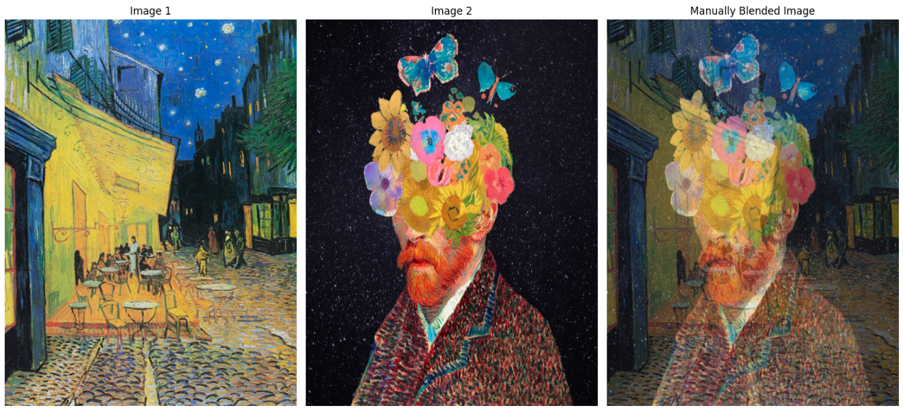

---

## 🧰 Part III: Interactive Photo Editing App

This is the main part of the project. A command-line interface allows users to interactively apply OpenCV transformations on an image.

### Features

- **Adjust Brightness**: `cv2.convertScaleAbs()` with `beta`
- **Adjust Contrast**: `cv2.convertScaleAbs()` with `alpha`
- **Convert to Grayscale**
- **Add Padding**: Custom padding options and ratios (Square, 4:3, Custom)
- **Thresholding**: Binary and Inverse binary using `cv2.threshold()`
- **Blending**: With another image using custom alpha values
- **Undo**: Restore previous image state from stack
- **View History**: Log of all operations performed
- **Save and Exit**: Export the final result

### Usage

```bash
$ python imageArithmetic.py
```

> Follow the on-screen menu to interact with the application.

📷 Screenshot Example:

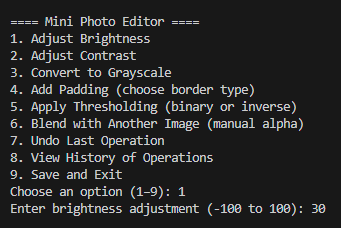

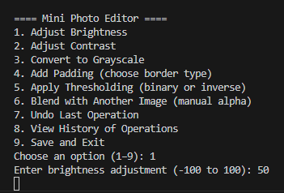

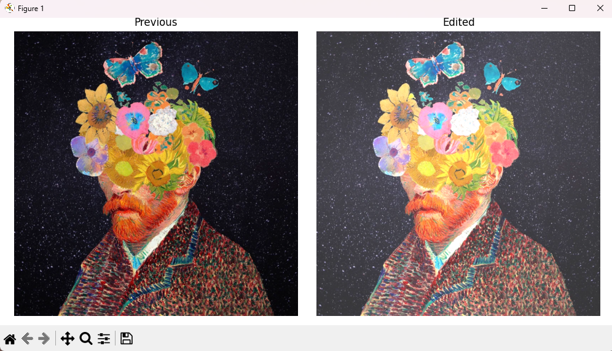

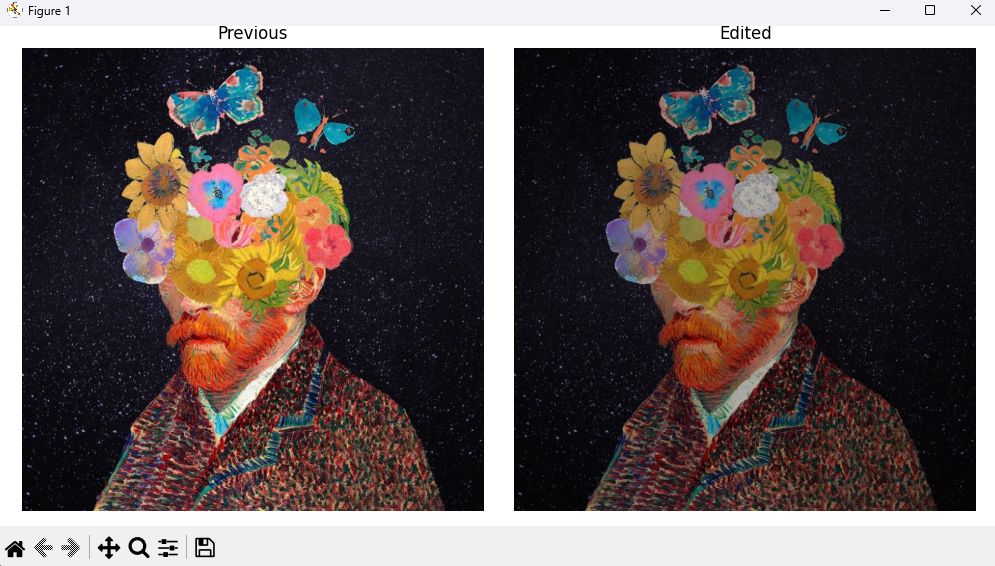

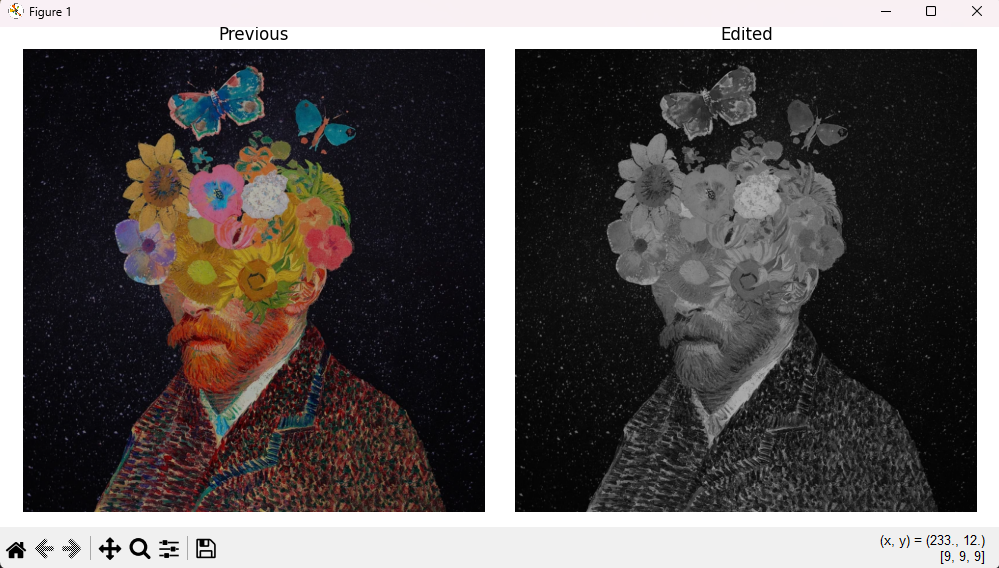

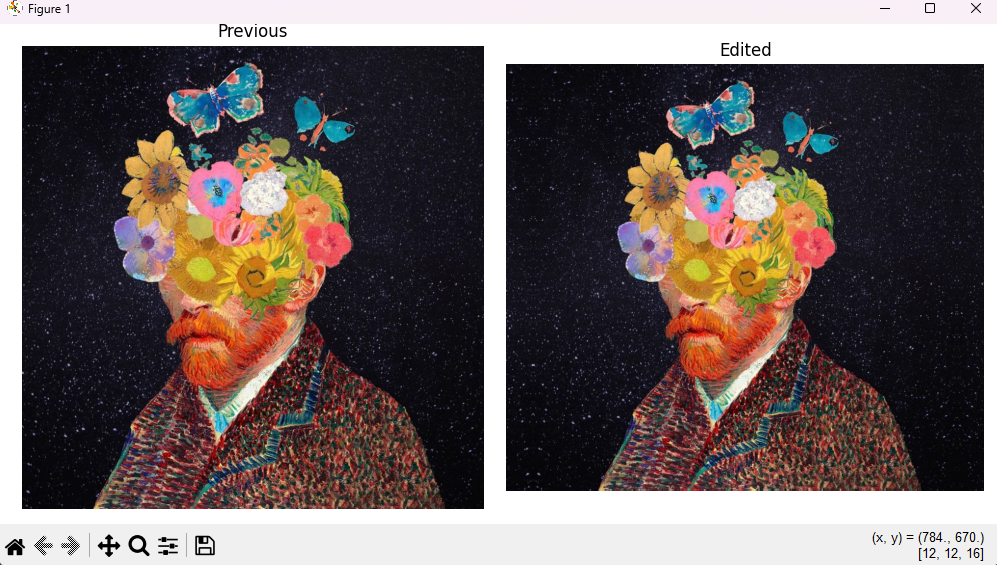

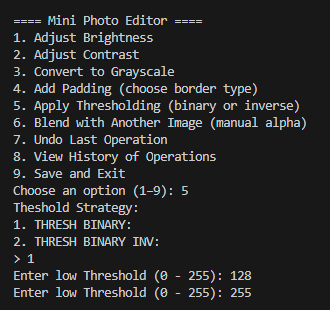

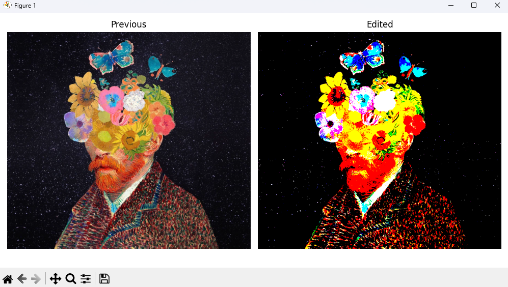

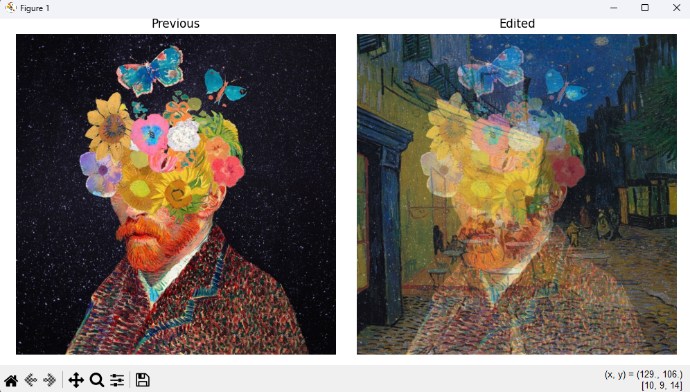

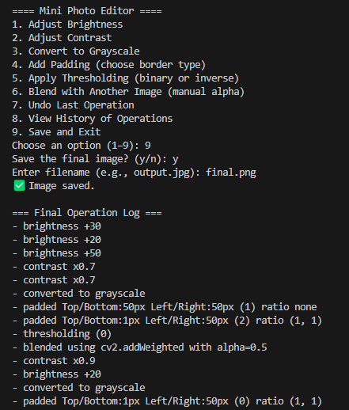

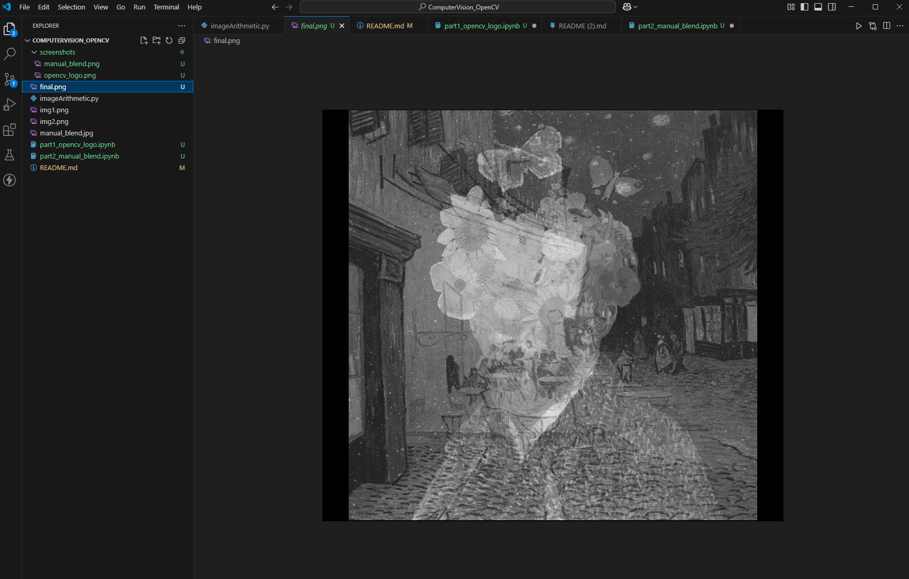

---

## 📝 Notes

- All operations are modularized as separate functions.
- Image previews are shown using `matplotlib` side-by-side.
- Ensure `cv2` and `matplotlib` are installed before running.

```bash
pip install opencv-python matplotlib
```

---

## ✅ Sample Log Output

```
1. brightness +20
2. contrast x1.5
3. converted to grayscale
4. padded Top/Bottom:20px Left/Right:20px (reflect) ratio (4, 3)
5. thresholding (0)
6. blended using cv2.addWeighted with alpha=0.6
```

---

## 👨‍💻 Author

Mostafa Hasanalipourshahrabadi  
Summer 2025 – CVI620: Computer Vision

---

## 📌 Academic Integrity

I declare that this submission complies with Seneca Polytechnic’s [Academic Integrity Policy](https://www.senecapolytechnic.ca/about/policies/academic-integrity-policy.html).
